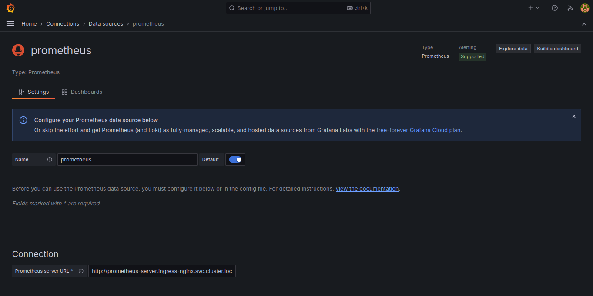
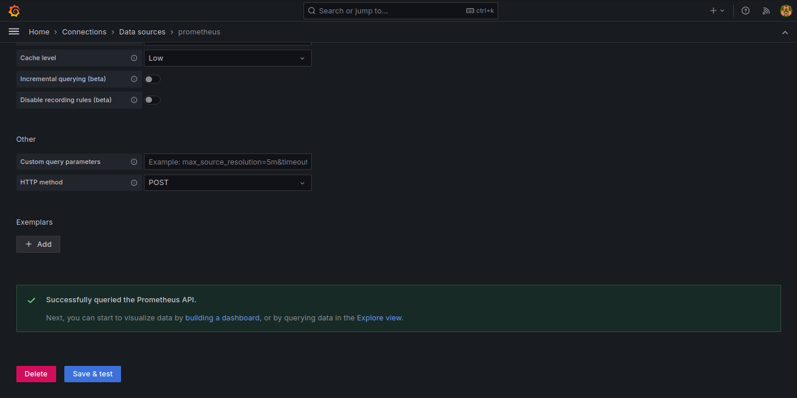
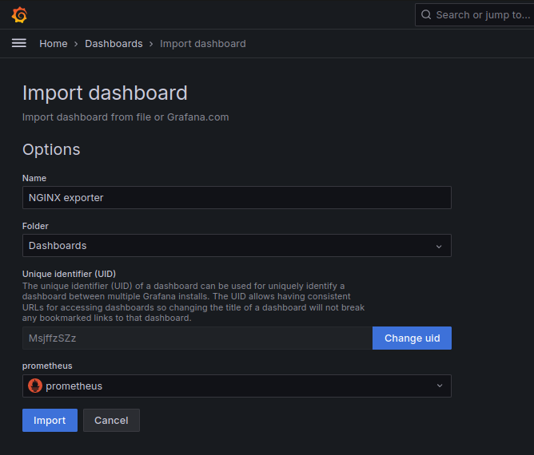
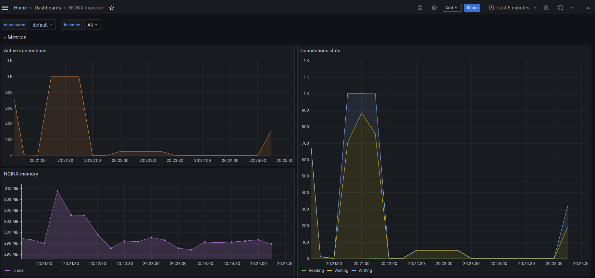
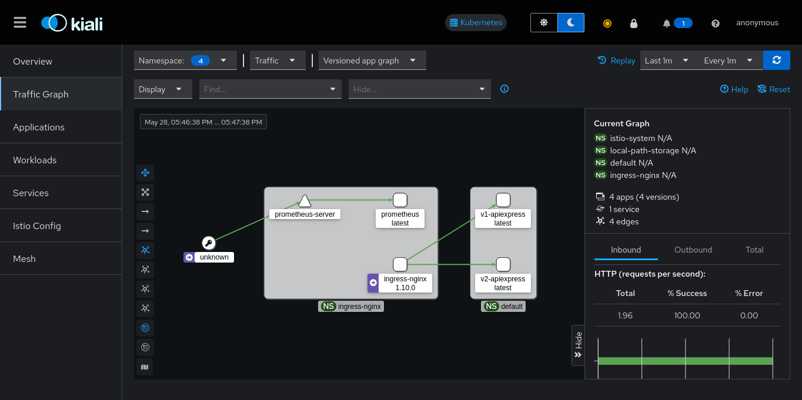

## Authors

- Baliarda Gonzalo
- Birsa Nicolás
- Perez Ezequiel Agustín
- Ye Li Valentín

## Assignment

- Create a Kubernetes cluster with one Master and at least two slaves, exposing an API on a generic port (different from 80).
- Implement a local database on a server (outside the cluster) and expose a service that redirects cluster traffic to the server.
- Deploy a web server (nginx or Apache HTTPD listening on port 80) and set up a reverse proxy to the API.
- Show two different versions of the API coexisting.
- Integrate Istio and Kiali services into the cluster.

## Table Of Contents

- [Authors](#authors)
- [Assignment](#assignment)
- [Table Of Contents](#table-of-contents)
- [Pre-requisites](#pre-requisites)
  - [Install Docker and Docker Compose](#install-docker-and-docker-compose)
  - [Install kubectl](#install-kubectl)
  - [Install kind](#install-kind)
- [Installation](#installation)
  - [Setup database](#setup-database)
  - [Setup Kubernetes Cluster](#setup-kubernetes-cluster)
    - [1. Create the cluster](#1-create-the-cluster)
    - [2. Build API Docker images](#2-build-api-docker-images)
    - [3. Load API images into the cluster](#3-load-api-images-into-the-cluster)
    - [4. Add the database Endpoint and Service configuration to the cluster](#4-add-the-database-endpoint-and-service-configuration-to-the-cluster)
    - [5. Add the API Deployment and Service configuration to the cluster](#5-add-the-api-deployment-and-service-configuration-to-the-cluster)
    - [6. Install Nginx Ingress controller](#6-install-nginx-ingress-controller)
    - [7. Apply the Ingress configuration to the nginx controller](#7-apply-the-ingress-configuration-to-the-nginx-controller)
    - [8. Port forward the Nginx controller Service](#8-port-forward-the-nginx-controller-service)
  - [Cleanup](#cleanup)
- [Test the APIs](#test-the-apis)
- [Cluster Monitoring](#cluster-monitoring)
  - [Istio](#istio)
    - [Download](#download)
    - [Install in the cluster](#install-in-the-cluster)
  - [Prometheus \& Grafana](#prometheus--grafana)
    - [Install](#install)
    - [Grafana Dashboard](#grafana-dashboard)
  - [Kiali](#kiali)
    - [Install](#install-1)
    - [Run](#run)
  - [Generating Traffic](#generating-traffic)

## Pre-requisites

- `docker`
- `docker compose`
- `kubectl`
- `kind`

### Install Docker and Docker Compose

Docker is a platform that enables developers to create, deploy, and run applications inside lightweight, portable containers, ensuring consistency across different environments.

Below are the instructions to [install Docker on Ubuntu](https://docs.docker.com/engine/install/ubuntu/). For other operating systems, refer to the [official documentation](https://docs.docker.com/engine/install/).

Before you install Docker Engine for the first time on a new host machine, you need to set up the Docker repository. Afterward, you can install and update Docker from the repository.

1. Set up Docker's apt repository.

    ```bash
    # Add Docker's official GPG key:
    sudo apt-get update
    sudo apt-get install ca-certificates curl
    sudo install -m 0755 -d /etc/apt/keyrings
    sudo curl -fsSL https://download.docker.com/linux/ubuntu/gpg -o /etc/apt/keyrings/docker.asc
    sudo chmod a+r /etc/apt/keyrings/docker.asc

    # Add the repository to Apt sources:
    echo \
      "deb [arch=$(dpkg --print-architecture) signed-by=/etc/apt/keyrings/docker.asc] https://download.docker.com/linux/ubuntu \
      $(. /etc/os-release && echo "$VERSION_CODENAME") stable" | \
      sudo tee /etc/apt/sources.list.d/docker.list > /dev/null
    
    sudo apt-get update
    ```

1. Install the latest version of Docker and Docker Compose.

    ```bash
    sudo apt-get install docker-ce docker-ce-cli containerd.io docker-buildx-plugin docker-compose-plugin
    ```

2. Verify installation:

    ```bash
    sudo docker run hello-world
    ```

3. To avoid having to use `sudo` with Docker and `kind` commands, create a Unix group called `docker` and add your user to it.

    ```bash
    sudo groupadd docker
    sudo usermod -aG docker $USER
    newgrp docker
    ```

    Verify that you can run Docker commands without `sudo`.

    ```bash
    docker run hello-world
    ```

### Install kubectl

Kubectl is a command-line tool used to interact with Kubernetes clusters, enabling users to deploy applications, inspect and manage cluster resources, and view logs. It acts as the primary interface for communicating with the Kubernetes API server, allowing for efficient cluster management and automation.

Below are the instructions to [install `kubectl` on Linux (x86_64)](https://kubernetes.io/docs/tasks/tools/install-kubectl-linux/#install-kubectl-on-linux). For other operating systems, refer to the [official documentation](https://kubernetes.io/docs/tasks/tools/#kubectl).

1. Download the latest release:

    ```bash
    curl -LO "https://dl.k8s.io/release/$(curl -L -s https://dl.k8s.io/release/stable.txt)/bin/linux/amd64/kubectl"
    ```

2. Install kubectl:

    ```bash
    sudo install -o root -g root -m 0755 kubectl /usr/local/bin/kubectl
    ```

3. Test to ensure the version you installed is up-to-date:

    ```bash
    kubectl version --client
    ```

### Install kind

Kind (Kubernetes IN Docker) is a tool for running local Kubernetes clusters using Docker containers, primarily designed for testing Kubernetes itself. It allows developers to create and manage multi-node clusters on their local machines, facilitating development and experimentation without the need for a full-scale cloud environment.

Below are the instructions to [install `kind` on Linux (x86_64)](https://kind.sigs.k8s.io/docs/user/quick-start/#installing-from-release-binaries:~:text=On-,Linux,-%3A). For other operating systems, refer to the [official documentation](https://kind.sigs.k8s.io/docs/user/quick-start/#installing-from-release-binaries).

```bash
[ $(uname -m) = x86_64 ] && curl -Lo ./kind https://kind.sigs.k8s.io/dl/v0.22.0/kind-linux-amd64
chmod +x ./kind
sudo mv ./kind /usr/local/bin/kind
```

## Installation

### Setup database

We'll set up a PostgreSQL database using Docker. The database will be accessible on port 5432, outside the k8s cluster that we'll create later.

1. Start Docker.
2. Run the docker compose file within the `database` folder.

    ```bash
    cd database
    docker compose up
    ```

By default, a [`users` table will be created](database/tables.sql).

### Setup Kubernetes Cluster

All the commands in the following section should be run from the root of the project.

#### 1. Create the cluster

We'll create a Kubernetes cluster called `redes-cluster` with one control plane and two worker nodes. The configuration for the cluster is defined in the [`cluster-config.yaml`](k8s/cluster-config.yaml) file.

```bash
kind create cluster --config ./k8s/cluster-config.yaml --name redes-cluster
```

You can check your running clusters with:

```bash 
kind get clusters
```

To check the nodes in the cluster, run:

```bash
kubectl get nodes
```

You should see three nodes running: one control plane and two workers.

#### 2. Build API Docker images

We'll build two Docker images for different versions of the API that will be deployed in the cluster.

```bash
docker build -t apiexpress:v1 api/v1
docker build -t apiexpress:v2 api/v2
```

The API is a simple Express application that connects to the PostgreSQL database to store and retrieve user information.

#### 3. Load API images into the cluster

We'll load the Docker images into the cluster so that they can be used by the Kubernetes deployment.

```bash
kind load docker-image apiexpress:v1 --name redes-cluster
kind load docker-image apiexpress:v2 --name redes-cluster
```

#### 4. Add the database Endpoint and Service configuration to the cluster

With the following command, we'll create a headless Service with a specific Endpoint that points to the external database.

```bash
kubectl apply -f k8s/database/
```

Since we're running the database in a Docker container, we'll point the Endpoint to the IP address associated with the Docker bridge network interface `docker0`. This IP address can be found by running the following command:

```bash
docker network inspect bridge | grep Gateway
```

Any pods within the Kubernetes cluster that need to connect to the database can do so by using the Service name `database`.

#### 5. Add the API Deployment and Service configuration to the cluster

First, we'll set the environment variables for the database connection using a Secret resource.

```bash
kubectl apply -f k8s/secret.yaml
```

Then, we'll create a Deployment for both versions of the API and expose them as Services.

```bash
kubectl apply -f k8s/api --recursive
```

Each Deployment will create three replicas of the API pod, and the Service will expose the API on port 8080.

#### 6. Install Nginx Ingress controller

Install the Nginx Ingress controller using the following command:

```bash
kubectl apply -f ./nginx/controller-nginx.yaml
```

This will also create the `ingress-nginx` namespace. You can check the pods running in this namespace with:

```bash
kubectl get pods -n ingress-nginx
```

#### 7. Apply the Ingress configuration to the nginx controller

The command below will wait for the Nginx Ingress controller pod to be ready, and then apply the Ingress configuration to it:

```bash
kubectl wait --namespace ingress-nginx --for=condition=ready pod --selector=app.kubernetes.io/component=controller --timeout=180s && kubectl apply -f ./nginx/ingress-nginx.yaml
```

#### 8. Port forward the Nginx controller Service

The following command will allow you to access the Nginx controller (and hence the API) from your localhost:

```bash
kubectl port-forward --namespace=ingress-nginx service/ingress-nginx-controller 8080:80
```

Before moving on, check that all pods are `Running` with the following command:

```bash 
kubectl get pods
```

### Cleanup

Once you're done testing, you can delete the cluster with the following command:

```bash
kind delete cluster --name redes-cluster
```

## Test the APIs

To test that both versions of the API are running, you can run the following commands:

```bash 
curl http://localhost:8080/v1
curl http://localhost:8080/v2
```

The difference between the two versions is that:
- V1 allows you to create and read users.
- V2 adds the ability to update and delete users.

We'll now explore the different functionalities of the API and the differences between the two versions.

1. Create test users.

    ```bash
    # V1
    curl -X POST -H "Content-Type: application/json" -d '{"username":"user1", "password":"pass1"}' http://localhost:8080/v1/user

    # V2
    curl -X POST -H "Content-Type: application/json" -d '{"username":"user2", "password":"pass2"}' http://localhost:8080/v2/user
    ```

2. Get the created users:

    ```bash
    # V1
    curl http://localhost:8080/v1/user/2

    # V2
    curl http://localhost:8080/v2/user/1
    ```

3. Update a user using V2:

    ```bash
    # V1, this should return an error
    curl -X PUT -H "Content-Type: application/json" -d '{"username":"newuser11", "password":"newpass11"}' http://localhost:8080/v1/user/1

    # V2
    curl -X PUT -H "Content-Type: application/json" -d '{"username":"newuser1", "password":"newpass1"}' http://localhost:8080/v2/user/1
    ```

4. Delete a user using V2:

    ```bash
    # V1, this should return an error
    curl -X DELETE http://localhost:8080/v1/user/2

    # V2
    curl -X DELETE http://localhost:8080/v2/user/1
    ```

## Cluster Monitoring

### Istio

#### Download

We'll install the latest `istioctl` version (1.22). To install a previous version, refer to the [Istio install page](https://istio.io/latest/docs/setup/getting-started/) to check the available options.

- Linux or macOS:
    ```sh
    curl -L https://istio.io/downloadIstio | sh -
    cd istio-1.22.0
    # The command below adds istioctl to the PATH variable, but only for the current session.
    # To make it permanent, add the bin folder to the PATH variable in the .bashrc or .bash_profile file.
    export PATH=$PWD/bin:$PATH
    ```
- Windows:
    1. Go to the [Istio releases page]() and download the latest version. We ran our tests on [v1.22.0](https://github.com/istio/istio/releases/download/1.22.0/istio-1.22.0-win.zip).
    2. Edit the system environment variables and add the path to the `bin` folder of the extracted zip file.

To verify that Istio can be installed in the Kubernetes cluster, run:

```sh
istioctl x precheck
```

#### Install in the cluster

To install Istio in the cluster, first delete the previously applied manifests. They will be reinstated after the installation is done.

```bash
kubectl delete -f k8s/database
kubectl delete -f k8s/api --recursive
kubectl delete -f nginx
```

We can now proceed with the installation by running the command below. We´ll use the _default_ configuration profile, but [others can be chosen](https://istio.io/latest/docs/setup/additional-setup/config-profiles/) based on the given case.

```sh
istioctl install --set profile=default -y
```

Then, we'll label the namespaces to let istio inject its "sidecars" for monitoring:

```sh
kubectl label ns default istio-injection=enabled
kubectl label ns ingress-nginx istio-injection=enabled
```

Now we can finally reinstate the previously removed manifests, using:

```sh
kubectl apply -f k8s/api --recursive
kubectl apply -f k8s/database
```

The same goes for the Nginx Ingress controller:

```sh
kubectl apply -f ./nginx/controller-nginx.yaml

kubectl wait --namespace ingress-nginx --for=condition=ready pod --selector=app.kubernetes.io/component=controller --timeout=180s && kubectl apply -f ./nginx/ingress-nginx.yaml
```

### Prometheus & Grafana

Prometheus is an open-source monitoring and alerting toolkit designed for reliability and scalability, used to collect metrics from monitored targets and then store and query those metrics. Grafana is a visualization tool that integrates with various data sources, including Prometheus, allowing users to create customizable dashboards and visualize metrics in real-time.

We'll use Prometheus to collect metrics from Nginx, and Grafana to visualize the collected data.

#### Install

Before installing Prometheus and Grafana, make sure to have the Nginx controller and service running. If not, refer to steps 6 and 7 of the "Setup Kubernetes Cluster" section.

To install Prometheus and Grafana in the cluster, run:

```sh
kubectl apply --kustomize k8s/prometheus
kubectl apply --kustomize k8s/grafana
```

You can check the running pods with:

```bash
kubectl get pods -n ingress-nginx
```

#### Grafana Dashboard

To access the Grafana dashboard, you must forward a port on your local machine (e.g. 3000) to port 3000 of the Grafana service running in the `ingress-nginx` namespace within your Kubernetes cluster, enabling direct access to the Grafana dashboard from your local browser.

```sh
kubectl port-forward -n ingress-nginx service/grafana 3000:3000
```

The Grafana dashboard will be accessible on `localhost:3000`, where the default username and password will both be `admin`.

To load the example dashboard from [`dashboard.json`](dashboard.json), follow these steps:

1. Using the search bar, go to "Data Sources".
2. Click on "Add data source".
3. Select Prometheus.
4. Enter the configuration details. The only mandatory one is the prometheus server URL, which should be `http://prometheus-server.ingress-nginx.svc.cluster.local:9090`.

    

5. Click on "Save and Test" at the end of the page. Then prometheus' availability will be queried, which should output a popup message as shown.

    

6. On the side menu, click on Dashboards. Then, click on New -> Import -> Upload dashboard JSON file.
7. Load the `dashboard.json` file located on the root of the project.
8. Select a Prometheus data source (you should see the default prometheus data source created on step 4). After these steps, the import screen should be as follows.

    

9. Click "Import". After that, you should be redirected to the home page and shown the imported dashboard.

    

### Kiali

Kiali is an observavility console for Istio. It lets you understand the structure and health of the service mesh by monitoring traffic flow. This way, it can infer the topology of the cluster and report errors.

#### Install

To install Kiali, simply apply its manifest:

```sh
kubectl apply -f k8s/kiali
```

Prometheus must also be installed, as Kiali uses its metrics to operate. In case the "Prometheus & Grafana" installation section was skipped, install Prometheus using:

```sh
kubectl apply --kustomize k8s/prometheus
```

#### Run

Wait for the Kiali pod to be ready, and then init the dashboard using `istioctl` to check the traffic on the cluster.

```sh
istioctl dashboard kiali
```

This should open up the Kiali UI at `http://localhost:20001`. There you can monitor multiple things, such as the _Traffic Graph_, which should look as follows:



Note that there must be traffic on the cluster, otherwise the previous graph will only contain idle nodes. Said traffic can be generated using the command shown on the following section.

### Generating Traffic

Traffic through both APIs running on the cluster can be generated using:

```sh
while sleep 1; do curl "localhost:8080/v1" && curl "localhost:8080/v2"; done
```
